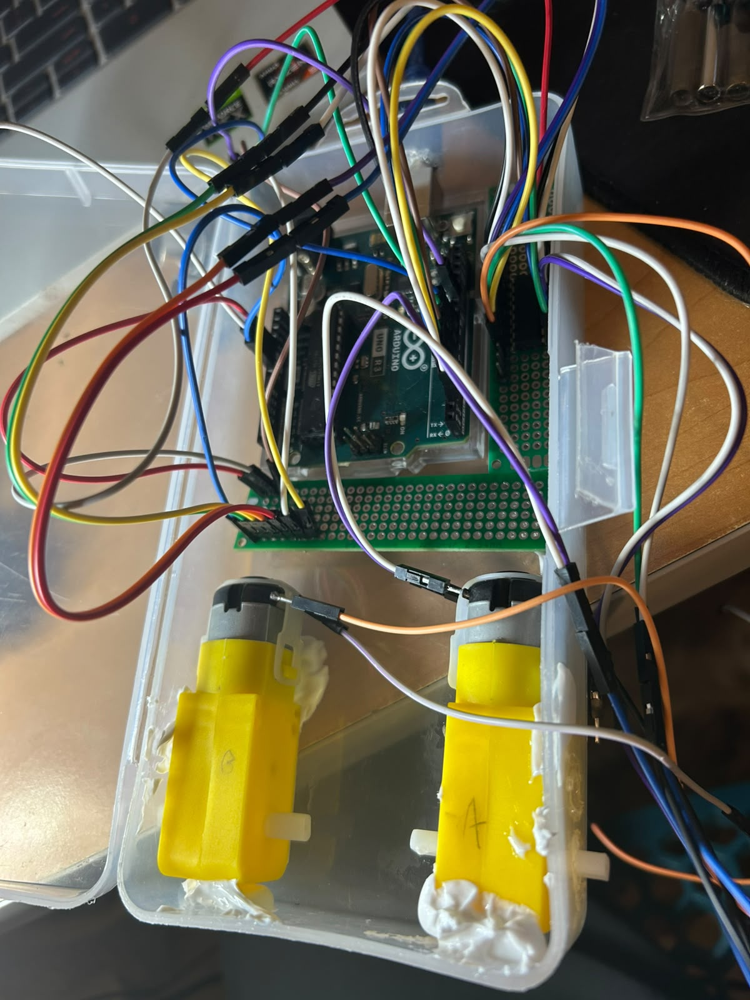
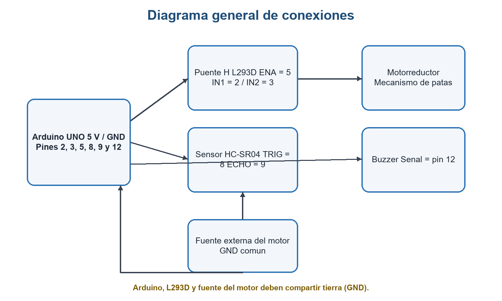
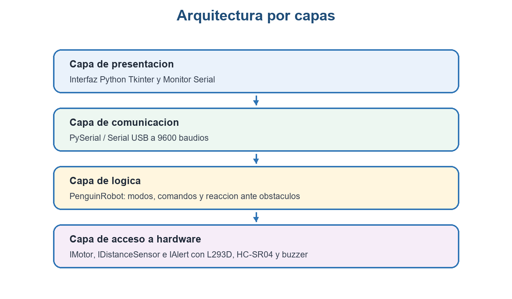
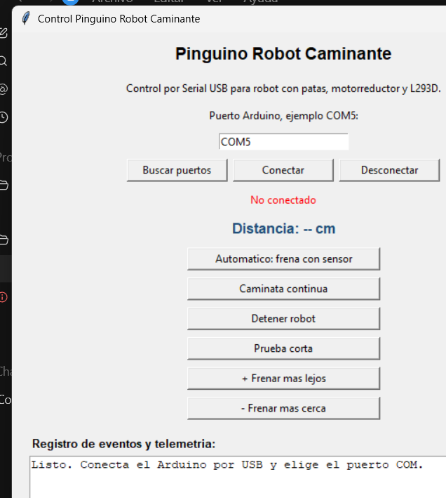
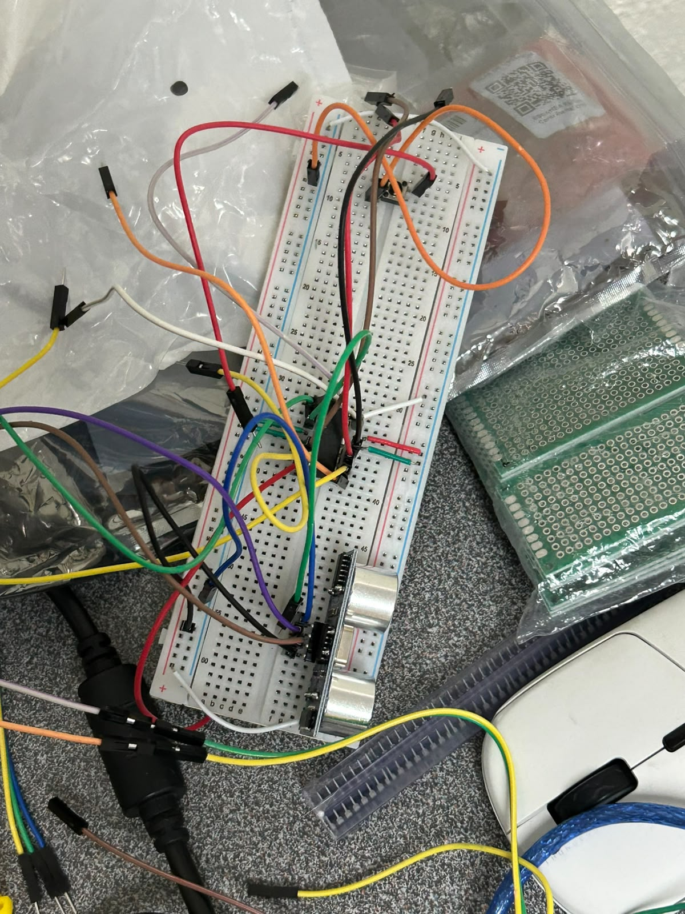

# Kagastian 5000

Robot caminante inspirado en un pingüino, desarrollado para el proyecto del
tercer parcial de Programación Avanzada. El robot no utiliza ruedas: un
motorreductor mueve un mecanismo de patas mientras un Arduino UNO coordina el
sensor ultrasónico, el buzzer y la comunicación con una interfaz en Python.



## Funciones principales

- Caminata automática con detección de obstáculos.
- Caminata continua para probar el mecanismo.
- Detención inmediata desde la computadora.
- Secuencia corta de avance, retroceso y alerta.
- Ajuste del umbral de detección entre 5 y 50 cm.
- Visualización de distancia, estado y eventos en tiempo real.
- Comunicación Serial USB a 9600 baudios.

Hardware

- Arduino UNO.
- Motorreductor TT.
- Puente H L293D.
- Sensor ultrasónico HC-SR04.
- Buzzer.
- Fuente USB para Arduino.
- Fuente externa para el motor con tierra común.

Pines

| Pin Arduino | Dispositivo |
|---|---|
| 5 | ENA del L293D |
| 2 | IN1 del L293D |
| 3 | IN2 del L293D |
| 8 | TRIG del HC-SR04 |
| 9 | ECHO del HC-SR04 |
| 12 | Buzzer |



## Software y estructura

```text
main/
  main.ino
  RobotPinguinoCaminante.h
  MotorL293DControl.h
  SensorUltrasonicoHCSR04.h
  AlertaBuzzer.h
  InterfazMotor.h
  InterfazSensorDistancia.h
  InterfazAlerta.h

python_gui/
  pinguino_gui_usb.py
  dist/PinguinoRobotUSB.exe

docs/
  Reporte_Final_Programacion_Avanzada_Kagastian_5000.pdf
  Reporte_Final_Programacion_Avanzada_Kagastian_5000.docx
  GUIA_EXAMEN_ORAL.md

imgs/
  Diagramas, interfaz y fotografías del prototipo

video/
  Evidencias de funcionamiento
```

La lógica depende de las interfaces `IMotor`, `IDistanceSensor` e `IAlert`.
Las clases `MotorL293D`, `UltrasonicSensor` y `BuzzerAlert` implementan esas
abstracciones. `PenguinRobot` recibe los componentes mediante su constructor y
coordina el comportamiento.



 Protocolo serial

| Comando | Acción |
|---|---|
| `A` | Modo automático |
| `C` | Caminata continua |
| `S` | Detener |
| `D` | Prueba corta |
| `+` | Frenar un centímetro más lejos |
| `-` | Frenar un centímetro más cerca |

Arduino devuelve mensajes de estado y mediciones con el formato
`Distancia: N cm`. La interfaz consulta el puerto cada 100 ms mediante
`ventana.after()`, por lo que no se congela mientras recibe datos.

## Cargar el programa en Arduino

1. Abrir `main/main.ino` en Arduino IDE.
2. Seleccionar la placa Arduino UNO.
3. Seleccionar el puerto COM.
4. Cargar el programa.
5. Cerrar el Monitor Serial antes de abrir la interfaz Python.

## Ejecutar la interfaz

Con Python:

```bash
pip install pyserial
python python_gui/pinguino_gui_usb.py
```

También puede utilizarse `python_gui/dist/PinguinoRobotUSB.exe`.



Evidencias




## Integrantes

- 6100090 - Diego De la O Arellano
- 6100093 - Hazel Ramírez Vázquez
- 6100103 - Diego Sebastián Espinoza Pérez
- 6100116 - Emilio Giovanni Meza Méndez
- 6100130 - David Alexander Torres Jalomo
